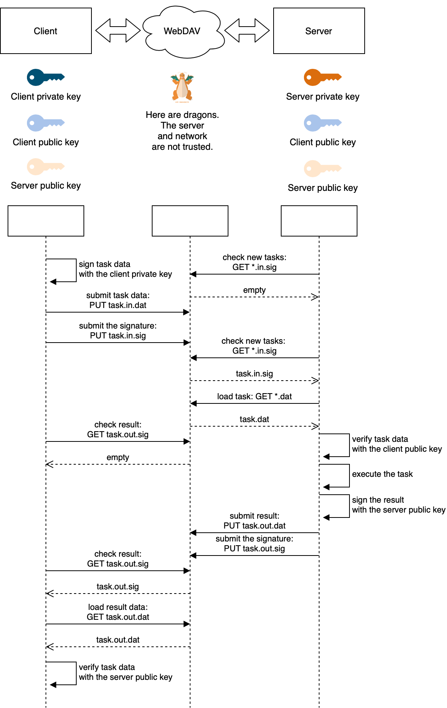

# Run remote task

Runs tasks on a remote machine with communication over a WebDAV server.

All messages are signed, which means you can use it even if you don't trust the WebDAV server. 
If data is modified in between, the task won't be executed or the result won't be accepted.
It's also fine to use HTTP, unless you're concerned about data being accessible to someone else.

## How it works

This diagram explains the interaction without going too deep into details:



## Usage

1. Generate two keypairs:

    ```sh
    openssl genrsa -out private-key-client.pem 2048
    openssl rsa -in private-key-client.pem -outform PEM -pubout -out public-key-client.pem
    
    openssl genrsa -out private-key-server.pem 2048
    openssl rsa -in private-key-server.pem -outform PEM -pubout -out public-key-server.pem
    ```

2. Upload the keys:

    * to client boxes:
        * `private-key-client.pem`
        * `public-key-client.pem`
        * `public-key-server.pem`
    * to the server box:
        * `private-key-server.pem`
        * `public-key-client.pem`
        * `public-key-server.pem`

3. Create a json config:

    ```json
    {
        "server": "http://your-webdav-server/with-path/",
        "user": "webdav-user",
        "password": "webdav-password",
        "clientPublicKey": "path/to/public-key-client.pem",
        "serverPublicKey": "path/to/public-key-server.pem",
        "clientPrivateKey": "path/to/private-key-client.pem",
        "serverPrivateKey": "path/to/private-key-server.pem",
        "pollMillis": 5000,
        "taskExpirationMillis": 600000,
        "command": "run_task.sh",
        "commandRetries": 10
    }
    ```
   
   Upload this config to both server and clients.

4. Write your task in `run_task.sh`. Your task receives two environment variables: 
    * `INPUT`: file with input data received from the client
    * `OUTPUT`: expected output file name that will be sent back

    Here's a hello world example:
    
    ```sh
    name=$(<$INPUT); echo "Hello, $name!">$OUTPUT
    ```

5. Run the server:

    ```sh
    npx run-remote-task --config=config.json --server
    ```

6. Test the client:

    ```sh
   npx run-remote-task --config=config.json --client --input=input.txt
    ```

## License

MIT
